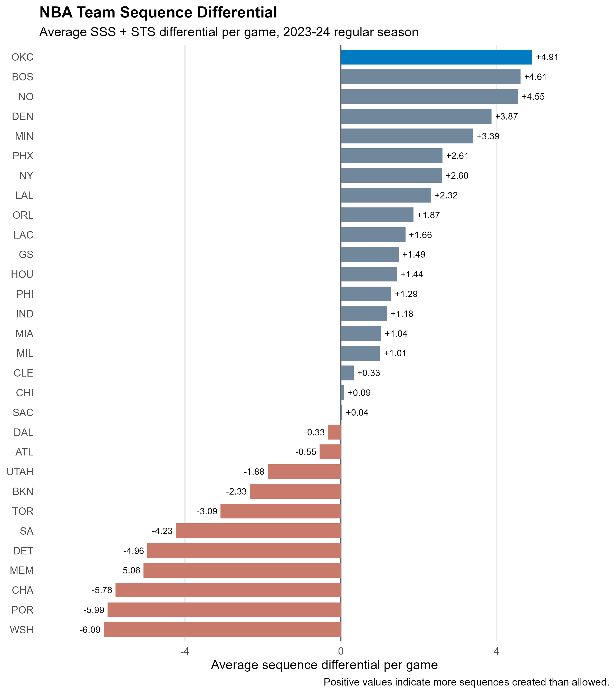
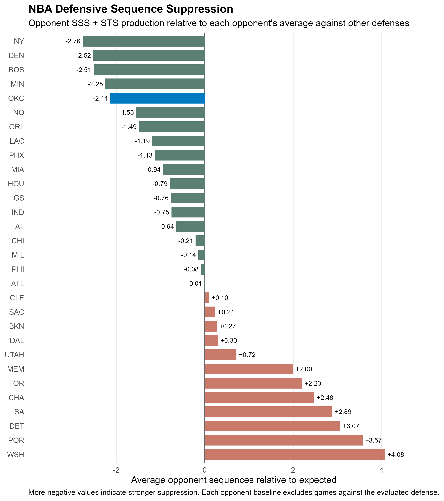
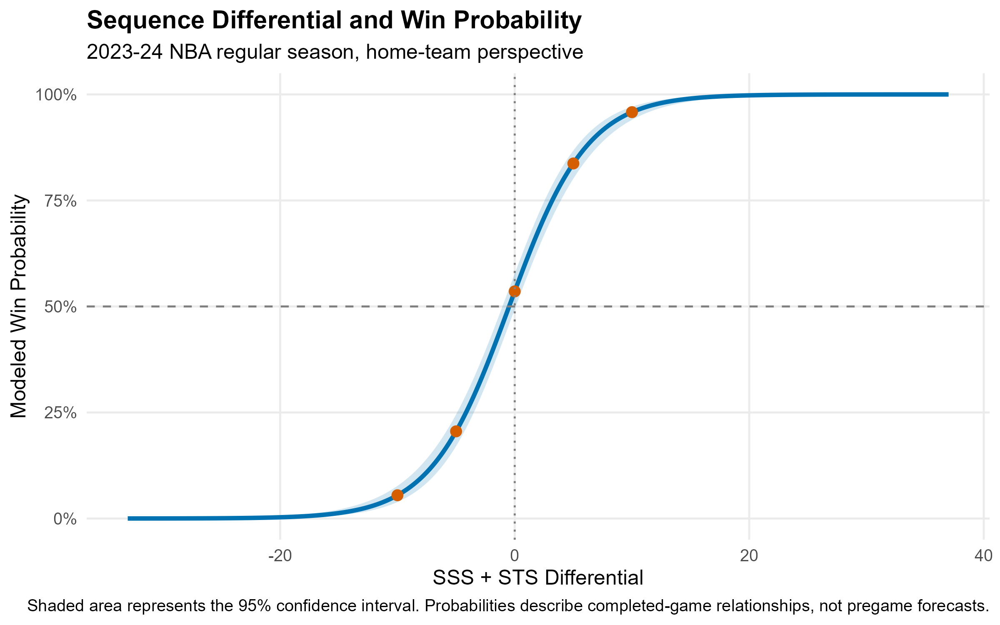
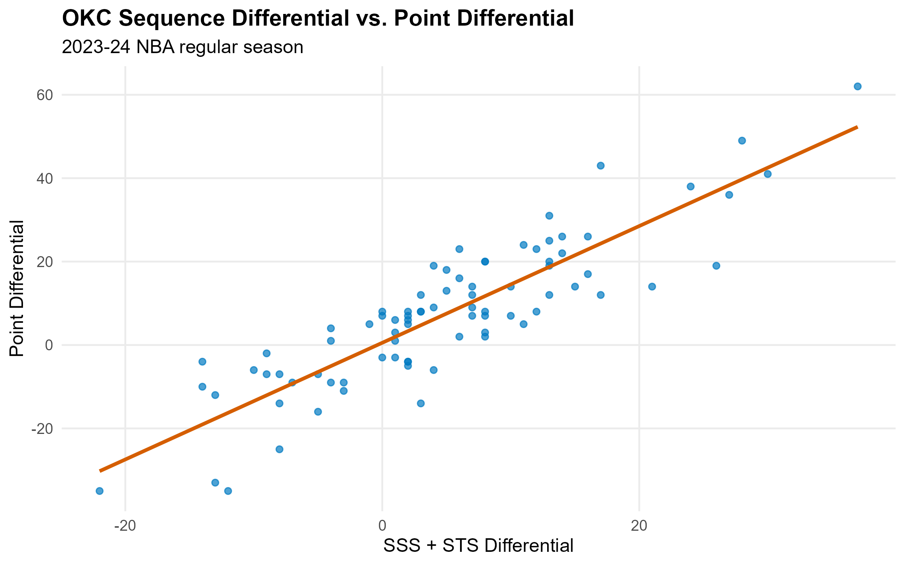

# NBA Score–Stop–Score and Stop–Score–Stop Sequence Analysis

## Overview

This project analyzes possession-level momentum sequences across the 2023–24
NBA regular season. It measures how often teams create two three-possession
patterns:

- **Score–Stop–Score (SSS):** a team scores, prevents its opponent from
  scoring, and scores again.
- **Stop–Score–Stop (STS):** a team prevents its opponent from scoring, scores,
  and prevents the opponent from scoring again.

The analysis asks three main questions:

1. Which teams created the largest advantage in SSS and STS sequences?
2. How strongly was sequence differential associated with point differential
   and winning?
3. How much did the Oklahoma City Thunder suppress opponents' normal sequence
   production?

The project began with an OKC-specific question, then expanded to all 30 teams
so that Oklahoma City's performance could be evaluated in league context.

## Headline findings

- **Oklahoma City ranked first in the NBA in sequence differential**, creating
  26.4 sequences per game while allowing 21.5, for an average differential of
  **+4.91**.
- Across all 1,230 regular-season games, sequence differential and point
  differential had a Pearson correlation of **0.838**.
- In a one-row-per-game linear model, each additional +1 in sequence
  differential was associated with approximately **1.27 points** of point
  differential. The model explained **70.3%** of game-level variation in point
  differential.
- SSS differential had a stronger conditional association with point margin
  than STS differential. Controlling for the other component, one additional
  SSS differential was associated with **1.50 points**, compared with **1.04
  points** for STS differential.
- Each +1 in total sequence differential was associated with a **34.8% increase
  in the odds of winning**. The modeled win probability rose from 20.6% at a
  −5 differential to 83.7% at +5.
- OKC held opponents to **2.14 fewer sequences per game** than those opponents
  normally produced against other defenses. This suppression effect was
  statistically significant in the prespecified one-sided test,
  *t*(81) = −3.516, *p* = 0.00036.

These relationships are descriptive. SSS and STS are defined using scoring and
stops observed during the game, so the models should not be interpreted as
causal estimates or pregame forecasts.

## Data

The script uses ESPN NBA play-by-play data distributed through the
[sportsdataverse data repository](https://github.com/sportsdataverse/sportsdataverse-data/releases/tag/espn_nba_pbp).
The repository labels the 2023–24 season as `2024`.

For reproducibility, the script downloads
`play_by_play_2024.rds` directly from the sportsdataverse GitHub release when a
local copy is absent. It stores the file at:

```text
data/nba_pbp_2024.rds
```

Later runs use the cached file instead of downloading it again. The raw RDS is
large and should normally be excluded from version control with `.gitignore`.
The code validates that the loaded data are nonempty and contain every required
column before beginning the analysis.

## Analysis sample

The final sample contains the official **1,230-game, 82-games-per-team** NBA
regular season.

The script:

- keeps regular-season events;
- removes All-Star teams and events;
- excludes the December 9, 2023 Lakers–Pacers In-Season Tournament championship
  because it did not count in the regular-season standings; and
- verifies that all 30 teams have exactly 82 games before proceeding.

Each league-wide regression uses one home-team-perspective row per game. This
avoids treating the two mirrored team rows from the same game as independent
observations.

## Methodology

### Possession construction

Event-level play-by-play is converted into possessions using made field goals,
defensive rebounds, turnovers, offensive fouls, final made free throws, and
period endings as possession boundaries.

Technical free throws are handled by tracking points for the team that actually
scored them. This prevents a technical free throw by one team from being
credited to the other team's surrounding live-ball possession. Sequence windows
are grouped within periods so that a sequence cannot span a quarter boundary.

### Sequence measurement

The script examines rolling three-possession windows and flags SSS and STS
patterns. It then creates two rows per game—one for each team—including:

- SSS count;
- STS count;
- total sequences;
- opponent SSS and STS counts;
- SSS, STS, and total sequence differentials;
- final score and point differential; and
- game result.

### Defensive suppression

For each defensive team, an opponent's sequence production in that matchup is
compared with the same opponent's average production against all other
defenses. Games against the evaluated defense are excluded from that opponent's
baseline.

A negative suppression effect means the opponent produced fewer sequences than
expected; more-negative values indicate stronger suppression.

### Statistical analysis

The project includes:

- Pearson and Spearman correlations;
- a league-wide point-differential regression;
- a component model separating SSS and STS differentials;
- a logistic model relating sequence differential to the probability of
  winning;
- opponent-adjusted defensive-suppression summaries;
- a one-sided test of OKC's mean suppression effect; and
- a sensitivity model restricted to games decided by 20 points or fewer.

## Detailed results

### League-wide relationship

The full-season model produced:

| Measure | Result |
|---|---:|
| Games | 1,230 |
| Pearson correlation | 0.838 |
| Regression slope | 1.27 |
| R-squared | 0.703 |

The component model produced:

| Component | Correlation with point differential | Adjusted model coefficient | 95% confidence interval |
|---|---:|---:|---:|
| SSS differential | 0.810 | 1.50 | 1.36 to 1.64 |
| STS differential | 0.774 | 1.04 | 0.90 to 1.18 |

Both components remained strongly associated with point differential while
controlling for the other. Separating them increased model R-squared only
slightly, from 0.703 to 0.706, indicating that total sequence differential
already captures most of their combined information.

### Win probability

The logistic model estimated an odds ratio of **1.348** for a one-unit increase
in sequence differential.

| Sequence differential | Modeled win probability |
|---:|---:|
| −10 | 5.5% |
| −5 | 20.6% |
| 0 | 53.6% |
| +5 | 83.7% |
| +10 | 95.8% |

Because the model uses the completed game's sequence differential, these values
describe the relationship between sequences and outcomes rather than providing
pregame predictions.

### Oklahoma City

| Measure | OKC result |
|---|---:|
| Games | 82 |
| Sequences created per game | 26.4 |
| Sequences allowed per game | 21.5 |
| Sequence differential | +4.91 |
| NBA sequence-differential rank | 1st |
| Expected opponent sequences | 23.7 |
| Average suppression effect | −2.14 |
| Median suppression effect | −2.45 |
| NBA suppression rank | 5th |

The game-weighted OKC suppression test yielded *t*(81) = −3.516 and a one-sided
*p* value of 0.00036. The upper bound of its one-sided 95% confidence interval
was −1.12 sequences, supporting the conclusion that opponents generated fewer
sequences against OKC than expected from their production against other teams.

## Robustness checks

The results were not dependent on a few extreme games:

- The Spearman rank correlation was **0.826**, close to the Pearson correlation
  of 0.838.
- After excluding games decided by more than 20 points, 1,012 games remained.
- Within that restricted sample, the correlation was **0.721**, the regression
  slope was **0.903**, and R-squared was **0.520**.
- The non-blowout coefficient remained strongly statistically significant
  (*p* < 0.001).

The lower correlation and R-squared in the restricted sample are expected
because removing blowouts deliberately narrows the range of point differentials.

## Visualizations

### League sequence differential



### Defensive sequence suppression



### Sequence differential and win probability



### Oklahoma City game-level relationship



## Reproducing the analysis

### Requirements

- R
- The `tidyverse` package
- An internet connection for the first run only

Install the required package if necessary:

```r
install.packages("tidyverse")
```

Run the project from the repository root:

```r
source("nba_sequence_analysis.r")
```

On the first run, the script creates `data/`, downloads the play-by-play RDS,
validates it, and caches it locally. Subsequent runs reuse that file. The script
stops with a clear error if the download is empty, unreadable, missing required
columns, or does not produce the expected 1,230-game regular-season sample.

## Repository structure

```text
nba-sss-sts-analysis/
├── README.md
├── nba_sequence_analysis.r
├── figures/
│   ├── okc_sequence_scatter.png
│   ├── win_probability_curve.png
│   ├── team_sequence_differential.png
│   └── team_suppression_rankings.png
├── data/                  # Local cache; excluded from Git
└── .gitignore
```

## Limitations

- This is a descriptive observational analysis and does not establish that
  creating an additional sequence causes a specific change in scoring margin or
  win probability.
- Because scoring and stops define SSS and STS, some association with point
  differential is inherent in the metric.
- Possessions are reconstructed from play-by-play event labels rather than an
  official possession identifier. Complex foul and administrative sequences may
  still contain classification edge cases.
- The analysis covers one NBA season. Results may differ across seasons or
  competitive environments.
- The defensive-suppression baseline adjusts for each opponent's normal sequence
  production but does not explicitly control for pace, lineups, injuries,
  rest, or other game context.
- The sportsdataverse source may be revised when upstream play-by-play records
  are corrected.

## Tools

- R
- tidyverse
- ggplot2
- ESPN play-by-play data distributed by sportsdataverse
